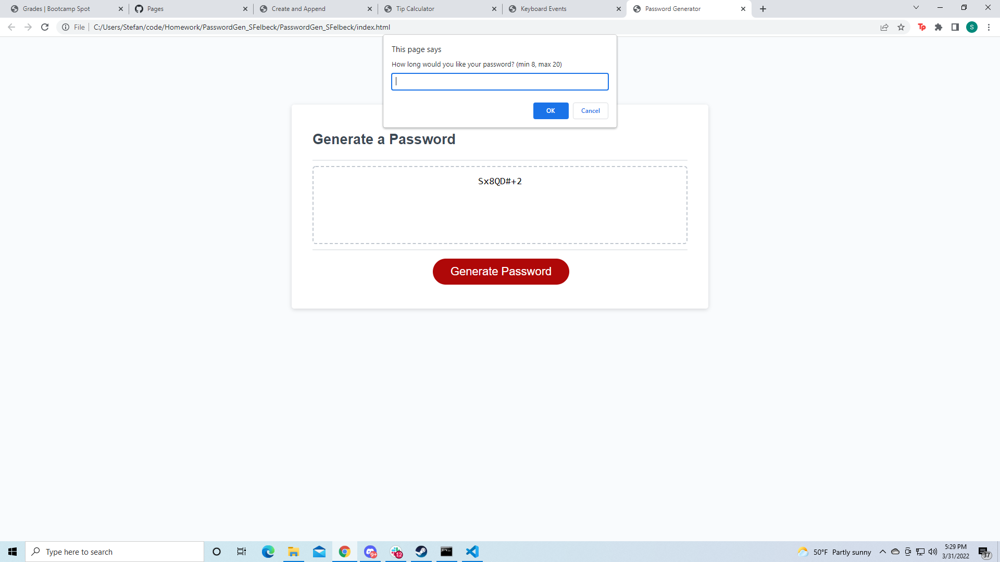
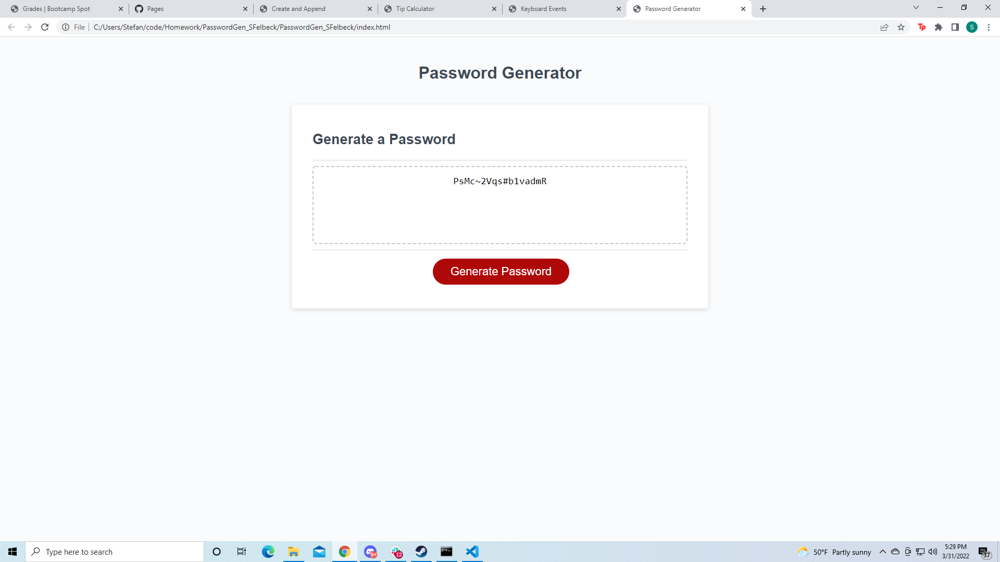

# PasswordGen_SFelbeck

For this assignment I was tasked with writing code in the javascript file to generate randomized passwords based on inputs from the user.
I started this project in a semi unconvetional way in which is set up the basic framework of the function and debugged backwords from there.
The reason I approached the project this way was that I began with a general understanding of what I needed to do and wanted to maintain the necessary elements of the code to reference while I'm still getting used to javascript syntax.

With advice from classmates I was able to streamline several aspects of the project that I had a bunch of unnecessary extra code for. Such as my primary if statement to determine strings used, which was originally over 10 ifs long before I made lowercase letters default.

below you can find screenshots of the beginning of the function as well as the end result.

<a href="https://sfelbeck.github.io/PasswordGen_SFelbeck/">You can find the site here</a>